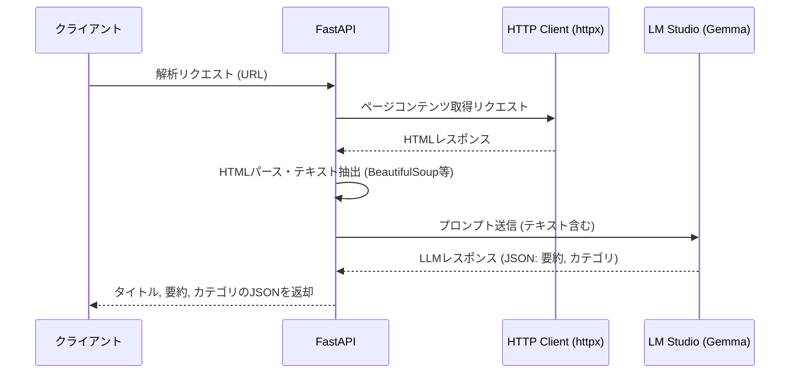

# 要件定義書: URL解析・要約API (URL Categorization API)

## 1. 概要 (Overview)

- **背景と課題**: ユーザーが大量のURLや共有されたリンクの内容を迅速に把握する必要があるが、各ページを個別に開いて内容を確認するのは時間がかかる。
- **目的**: 入力されたURLのウェブページを取得・解析し、ページタイトル、要約文、および適切なカテゴリを自動生成して返却するAPIを提供する。これにより、リンク内容の事前把握を効率化する。
- **ターゲット**: フロントエンドアプリケーション（ブックマークアプリやチャットツール等）からの呼び出し、または外部システムからの連携利用。

## 2. スコープ (Scope)

- **In-Scope**:
  - 指定されたURLからのHTMLコンテンツ（主にテキストデータ）の取得。
  - HTMLからの不要なタグ（script, style等）の除去とテキスト抽出。
  - ローカルのLM Studio（LLM: Gemma）を利用したテキストの要約とカテゴリ推論。
  - タイトル、要約、カテゴリ（最大3つ）をJSON形式で返却するREST APIエンドポイントの提供。
- **Out-of-Scope**:
  - 認証・認可機能（初期フェーズではローカル環境や内部利用を想定しスコープ外）。
  - クローリング対策が強固なサイト（CAPTCHA要求など）の突破。
  - 画像や動画コンテンツの解析。
  - 解析結果の永続化（データベース保存）。

## 3. 確認事項・不明点 (Clarifying Questions)

- [x] 対象URL先が動的レンダリング（SPA）の場合、JavaScriptの実行を待つヘッドレスブラウザ（Playwright等）を利用するか、静的HTMLのみの取得とするか？
  - **決定**: 処理速度と構成のシンプルさを優先し、**静的HTMLのみの取得**とする。SPAによるクライアントサイドレンダリングコンテンツの取得漏れは許容する。
- [x] LM Studio（Gemma）へ渡すテキスト長には上限があるため、トークン上限を超えた場合は先頭から一定文字数（例: 4000文字）で切り捨てる方針でよいか？
  - **決定**: OK。先頭4000文字で切り捨てる処理を実装する。
- [x] LM Studio APIのベースURL（デフォルト: `http://localhost:1234/v1`）の環境変数設定について。
  - **決定**: `.env` で設定可能とし、デフォルト値を `http://localhost:1234/v1` とする。

## 4. 機能要件 (Functional Requirements)

### 4.1 機能一覧 (Feature List)

- **[FR-01] URL解析エンドポイント**: `POST /api/v1/analyze` または `GET /api/v1/analyze?url=...`。対象のURLを受け取り、解析結果を返す。
- **[FR-02] コンテンツ抽出**: URL先のページから `<title>` タグおよび `<body>` 内のテキストを抽出・サニタイズする機能。
- **[FR-03] LLM連携機能**: 抽出したテキストをLM Studio (OpenAI API互換インターフェース) に送信し、指示プロンプトに基づき「要約」と「カテゴリ」を生成させる機能。

### 4.2 処理フロー (Sequence Diagram)



### 4.3 詳細仕様 (Detailed Specs)

#### A. 解析リクエスト API

- **エンドポイント**: `POST /api/v1/analyze`
- **リクエストボディ**:
  ```json
  {
    "url": "https://example.com/article/123"
  }
  ```
- **レスポンスボディ (正常系)**:
  ```json
  {
    "title": "Example Domain",
    "summary": "このドメインは、ドキュメントの例として使用するために設立されました。",
    "categories": ["テクノロジー", "リファレンス"]
  }
  ```
- **LLM連携プロンプト**:
  - **System Prompt**: 「あなたは優秀なアシスタントです。与えられたウェブページのテキストを分析し、JSON形式で要約（200文字以内）とカテゴリ（最大3つ）を出力してください。」
  - **Format Requirement**: OpenAI API互換機能を用いたJSON出力指定（`response_format: { "type": "json_object" }`）またはPydanticを利用したStructured Outputを利用して、確実なJSON形式のレスポンスを担保する。

### 4.4 エッジケース・異常系

| ケース                 | 期待する挙動                                                                         | HTTPステータスコード    |
| ---------------------- | ------------------------------------------------------------------------------------ | ----------------------- |
| 無効なURL形式          | 「URLの形式が正しくありません」というエラーメッセージを返却。                        | `422 Unprocessable Entity` |
| URL到達不可・タイムアウト| 「ページの取得に失敗しました」というエラーメッセージを返却。(タイムアウト: 10秒等)   | `502 Bad Gateway`       |
| ページが長すぎる       | LLMのコンテキストウィンドウに合わせてテキストをトランケートして処理を継続。            | 正常処理 (`200 OK`)     |
| LM Studio 未起動/エラー| 「LLMサービスの呼び出しに失敗しました」というエラーメッセージを返却。                | `503 Service Unavailable`|

## 5. 非機能要件 (Non-Functional Requirements)

### 5.1 セキュリティ (Security)

- **SSRF (Server-Side Request Forgery) 対策**: ローカルIP（`127.0.0.1`, `192.168.x.x`, `10.x.x.x`等）へのURL解決・リクエストを禁止するバリデーションを実装。
- **入力サニタイズ**: 取得したHTMLに含まれる悪意のあるスクリプトを安全に除去し、純粋なテキストのみをLLMに渡すように制御。

### 5.2 パフォーマンス (Performance)

- **タイムアウト設定**:
  - ページコンテンツの取得 (HTTPリクエスト): 10秒。
  - LM Studioからの推論応答: 30秒〜60秒（ローカルLLMの性能依存）。
- **非同期処理**: FastAPIの `async/await` および非同期HTTPクライアント（`httpx` 等）を利用し、LLM応答待ちの間もアプリケーションの別のリクエストをブロックしない設計とする。

### 5.3 可観測性 (Observability)

- **ログ出力**: リクエストURL、実行時間、処理ステータス、およびLLM側でのエラー（トークンオーバーなど）をアプリケーションログとして出力する（構造化ログ推奨）。

## 6. データモデル (Data Model)

※ 本APIでは永続化を行わないため、内部処理および入出力スキーマとしてのPydanticモデルを定義する。

```python
from pydantic import BaseModel, HttpUrl, Field
from typing import List

class AnalyzeRequest(BaseModel):
    url: HttpUrl = Field(..., description="解析対象のURL")

class AnalyzeResponse(BaseModel):
    title: str = Field(..., description="抽出したページタイトル")
    summary: str = Field(..., description="LLMが生成したページの説明文（要約）")
    categories: List[str] = Field(..., max_length=3, description="LLMが推論したカテゴリリスト（最大3件）")
```

## 7. 技術スタック (Tech Stack)

- **Web Framework**: FastAPI (Python 3.10+)
- **HTTP Client**: `httpx` (非同期通信用)
- **HTML Parsing**: `BeautifulSoup4` (HTMLパース・テキスト抽出)
- **LLM Client**: `openai` (Pythonクライアントを用いて、LM StudioのOpenAI互換エンドポイントへリクエスト)
- **Server**: `Uvicorn`

## 8. リスクと対策 (Risks & Mitigation)

- **LLMのハルシネーションとJSONパースエラー**:
  - LLMが必ずしも期待した構造のJSONを返さない可能性がある。
  - **対策**: Pydanticと連携して出力スキーマを強制するライブラリ（例: `instructor` やLangChain等）の利用、あるいはパース失敗時のリトライ・フォールバック機構を導入する。
- **スクレイピングブロック**:
  - CloudflareやBot対策ツールによって、一般的なHTTPクライアントからのHTML取得が拒否されるケース（`403 Forbidden` など）。
  - **対策**: `User-Agent` を一般的なブラウザのものに偽装する。それでも取得できない場合は `502` エラーなどを適切に返し、クライアントに通知する設計とする。
